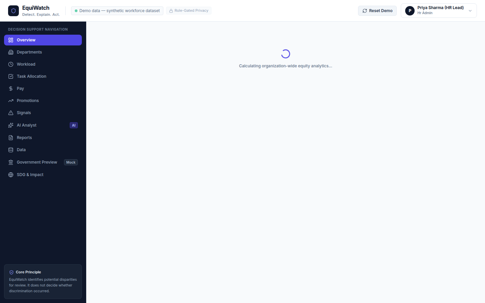
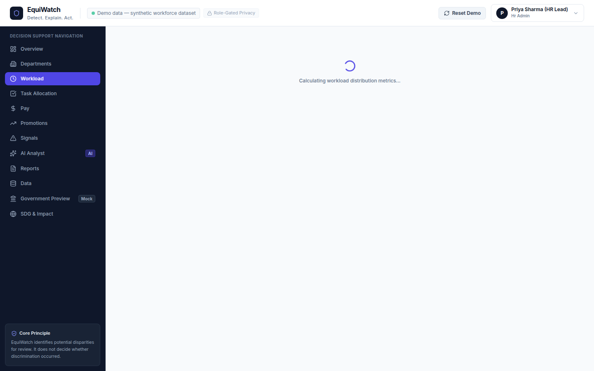
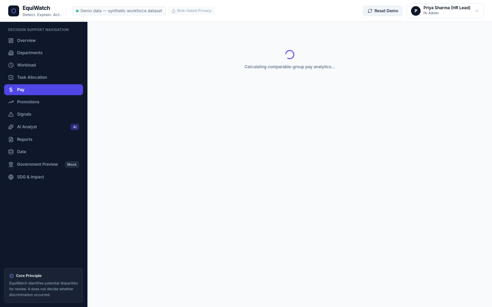
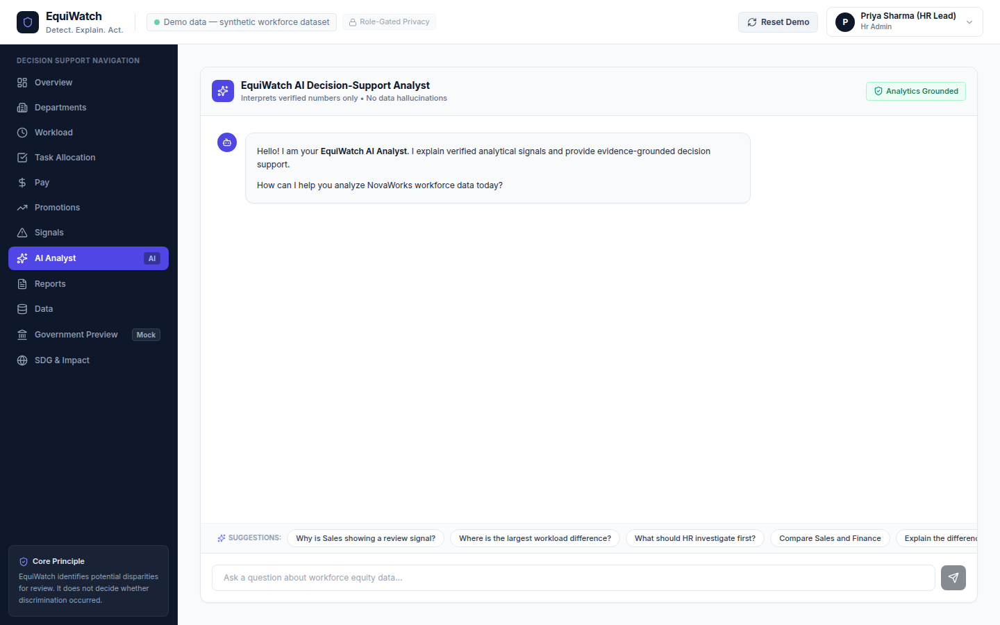

# EquiWatch

<p align="center">
  <a href="https://equiwatch-analytics.vercel.app"></a>
  
  
  
  
</p>

> **Detect. Explain. Act.**  
> *An AI-powered workplace gender-equity decision-support watchdog.*

🔗 **Live Production Application:** [https://equiwatch-analytics.vercel.app](https://equiwatch-analytics.vercel.app)

---

## 📸 Interface & Analytics Showcase

| Workplace Equity Overview | Workload & Overtime Analysis |
| :---: | :---: |
|  |  |

| Comparable Pay & Compensation Gaps | AI Analyst & Copilot Assistant |
| :---: | :---: |
|  |  |

---

EquiWatch is a full-stack, production-grade SaaS analytics application that analyzes organizational workforce data (tasks, hours, roles, seniority, compensation, and promotions) to identify potential gender-equity disparities, explain longitudinal patterns using grounded statistical methods, and provide HR teams with actionable investigation roadmaps.

EquiWatch is strictly a **decision-support system**, not an autonomous judge. It detects potential disparities for human review without asserting guilt, illegal conduct, or intentional discrimination.

---

## 🌟 Key Features

1. **Workplace Equity Overview**: Real-time status across all departments with a prioritized **"Where Should HR Look First?"** review queue.
2. **Comparable-Group Fairness Checks**: Controls for role title, seniority tier, department, and tenure to demonstrate that not every raw difference is a structural disparity (e.g., explaining why raw salary gaps disappear when controlling for seniority).
3. **Four Core Analytical Pillars**:
   - **Workload**: Average hours, overtime distribution, and Mann-Whitney U tests.
   - **Task Allocation**: Categorized into 7 areas (*administrative, coordination, operational, technical, strategic, client-facing, leadership*), identifying non-promotable work burdens.
   - **Pay & Compensation**: Raw median vs comparable-group controlled pay gaps, bonus allocations, and merit increment percentages.
   - **Promotions & Velocity**: Multi-quarter advancement rates, widening gap trajectory detection, and average tenure in band before promotion.
4. **"What Should HR Do?" Action Experience**: Instant drawer generating evidence dossiers, customized leadership 1-on-1 discussion scripts, data audit checklists, and threshold explanations.
5. **"Explain This Trend" AI Chart Interpretation**: Ingests verified underlying numbers (not screenshots) to provide contextual observations and key caveats.
6. **Conversational AI Analyst**: Side panel assistant that answers complex HR inquiries while citing verified metric badges and sources.
7. **Executive Review Dossier Generator**: One-click department and company-wide report generator with printable/PDF export styling.
8. **Validated CSV Ingestion & Data Management**: Drag-and-drop CSV importer with strict schema validation, type checking, and deduplication.
9. **Empirical Precision/Recall Harness**: Honest validation benchmark measuring actual precision and recall on synthetic control cases without fabricated numbers.
10. **Government Sector Monitor (Future Scope Concept)**: Anonymized, aggregated cross-industry oversight with zero employee PII leakage.

---

## 🛠️ Tech Stack

| Layer | Technology |
| :--- | :--- |
| **Frontend** | React 19, TypeScript, Tailwind CSS, Recharts, Lucide React, React Router v7 |
| **Backend** | Python 3.9+, FastAPI, Pydantic v2, SQLAlchemy 2.0 |
| **Data & Stats** | Pandas, NumPy, SciPy (Mann-Whitney U, Chi-Square, t-tests), Scikit-learn |
| **AI Layer** | Grounded prompting with Gemini API / OpenAI support & local deterministic fallback engine |
| **Database** | SQLite (zero-config local start) / PostgreSQL (production) |
| **DevOps** | Docker, Docker Compose |

---

## 🚀 Quickstart Guide

### Option 1: Local Development (Fastest)

#### 1. Backend Setup
```bash
# Navigate to backend directory
cd backend

# Create and activate virtual environment
python3 -m venv venv
source venv/bin/activate  # On Windows: venv\Scripts\activate

# Install dependencies
pip install -r requirements.txt email-validator

# Run backend server (Auto-seeds demo dataset on first start)
PYTHONPATH=. uvicorn app.main:app --host 0.0.0.0 --port 8000 --reload
```
*Backend API will run at `http://localhost:8000` (API Docs at `http://localhost:8000/docs`).*

#### 2. Frontend Setup
```bash
# Open a new terminal in the frontend directory
cd frontend

# Install dependencies
npm install

# Start Vite dev server
npm run dev
```
*Frontend UI will open at `http://localhost:5173`.*

---

### Option 2: Docker Compose
```bash
# Build and run all services in containers
docker-compose up --build
```
- Frontend: `http://localhost:5173`
- Backend API: `http://localhost:8000`

---

## 🔑 Demo Login Credentials

For quick evaluation, click the one-click demo role buttons on `/login` or enter:

| Role | Email | Password | Access Level |
| :--- | :--- | :--- | :--- |
| **HR Lead (Recommended)** | `hr@novaworks.com` | `equiwatch2025` | Full analytics, signals, AI assistant, and reports |
| **System Admin** | `admin@novaworks.com` | `admin2025` | Full system administration and data ingestion |
| **Department Viewer** | `viewer@novaworks.com` | `viewer2025` | Read-only analytics dashboards |
| **Policy Auditor** | `gov_monitor@policy.org` | `policy2025` | Government Preview (Aggregated anonymized sector metrics only) |

---

## 🎭 The NovaWorks Demo Story Walkthrough

The seeded synthetic dataset models **NovaWorks Technologies** (1,200+ employees, 5 departments, 8 longitudinal quarters):

1. **Login as HR Lead** (`hr@novaworks.com`).
2. **Dashboard Overview**: Notice the top alert: *"4 potential equity signals require review"*.
3. **Inspect Priority Queue**: The **"Where should HR look first?"** queue flags **Sales** for persistent task allocation and promotion disparities.
4. **Open Sales Deep-Dive**:
   - **Task Allocation**: See that women carry **61% of administrative tasks** vs **39% for men** (a 22.0 pp difference).
   - **Promotions**: View the 8-quarter trajectory where female promotion rates (**18.4%**) lag male rates (**26.7%**) by **8.3 pp**, with the gap widening over time.
   - **Explain with AI**: Click *"Explain this trend"* to see structured natural-language observations.
5. **Compare with Finance**:
   - Open **Finance** to observe an apparent raw pay difference that **disappears completely** when controlling for role title and seniority bands (99.2% parity within comparable tiers).
6. **Trigger Decision Actions**:
   - On the Sales signal, click **"What should HR do?"** to generate customized leadership 1-on-1 discussion scripts and investigation checklists.
7. **Generate Report**:
   - Click **"Generate Department Report"** to produce an official printable review dossier.
8. **Test Empirical Accuracy**:
   - Visit `/impact` to review the live **Empirical Precision & Recall Benchmark Harness** run directly against 100 control test cases.

---

## 🧪 Automated Testing

Run the full automated test suite (testing analytics math, comparable group controls, signal detection, and API endpoints):

```bash
# Run pytest in backend
PYTHONPATH=backend backend/venv/bin/pytest backend/tests
```

Run frontend production build verification:
```bash
cd frontend && npm run build
```

---

## 🌍 UN SDG Alignment & Business Model

- **Primary**: **SDG 5 — Gender Equality** (Target 5.5: Equal opportunity for leadership and career advancement).
- **Supporting**: **SDG 8 — Decent Work** (Target 8.5) and **SDG 10 — Reduced Inequalities** (Target 10.3).
- **Commercial SaaS Model**: B2B recurring subscription with automated HRIS/payroll connectors and continuous equity audit dossiers.

---

## 📜 Ethical Principles & Limitations

- **No Autonomous Decisions**: EquiWatch does not determine that discrimination has occurred.
- **Minimum Sample Safeguards**: Requires a minimum cohort sample ($n \ge 8$) before raising signals.
- **Privacy by Design**: Role-gated views prevent PII exposure to external monitors.
